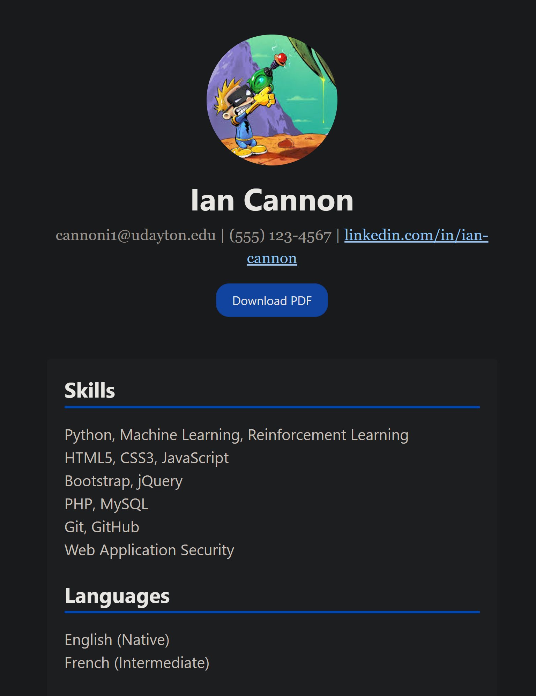
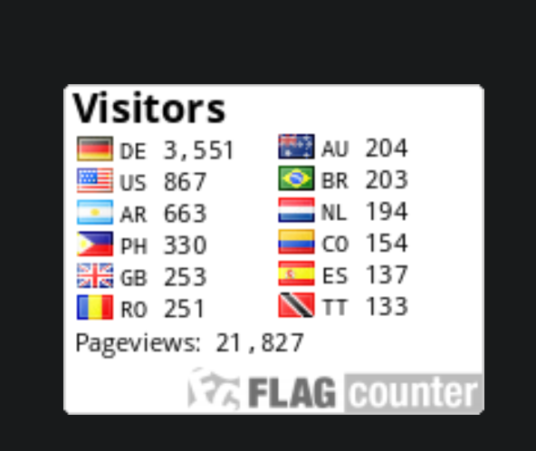

# Web Application Programming and Hacking
Instructor: Dr. Phu Phung

Student: Ian Cannon

**Email**: [mailto:cannoni1@udayton.edu](cannoni1@udayton.edu)

**Short-bio**: Ian Cannon interests in Reinforcement Learning for Autonomous Control. 

## Repository Information

Respository's URL: [https://github.com/Spiph/Spiph](https://github.com/spiph/WebAppDev)

This is a public repository for Ian Cannon to store all code from the course. The organization of this repository is as follows.

### General Requirements

Look I made a website! with css and my headshot resume and contact. You can also see the CSS that I added.

Here is my vitors flag counter.

